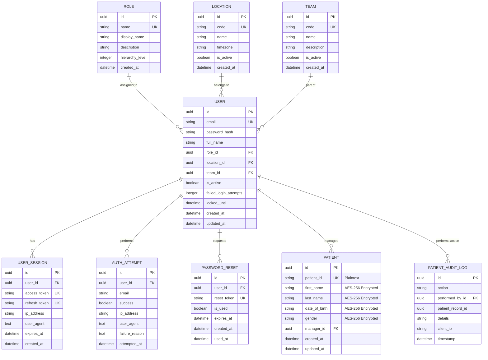

# Database Schema Documentation

## Entity Relationship Diagram

## Table Descriptions

### roles
Defines the hierarchical permission structure (`hierarchy_level`: 1=Admin, 2=Manager, 3=User).

### locations
Geographic locations for user assignment (US, IN, EU, AU).

### teams
Organizational teams (AR, EPA, PRI).

### users
The central entity for authentication and authorization. Stores hashed passwords (Argon2id) and account status.

### patients (Assignment 2)
Stores patient records with **Application-Level Encryption (AES-256-GCM)** for all PII fields. Only `patient_id` remains in plaintext for indexing.

### phi_audit_logs (Assignment 2)
Maintains a strict record of all PHI access and modifications for HIPAA compliance.

### user_sessions
Tracks active JWT sessions for revocation capability during logout or security breaches.

### auth_attempts
Security audit log for all failed and successful login attempts.

### password_resets
Stores temporary tokens for the secure password reset flow.
